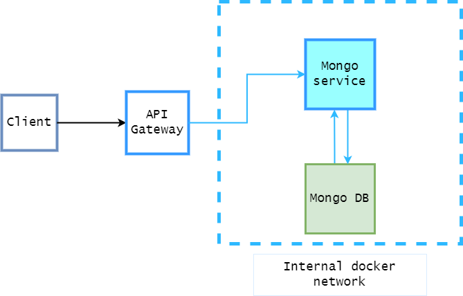

# TODO-List
TODO-List is a primitive example of cloud project, based on microservice architecture, which allows planning further steps by making notes.
## Architecture

## Usage
You can navigate to [deployed demo project](http://dockhero-corrugated-07617.dockhero.io/). It's deployed to [Heroku](https://www.heroku.com/) on `DockHero` addon.
## Local Build
Navigate to project root directory.
```code
docker compose up
```
Server should be started on `localhost:8080`
## API
Mongo service is responsible for managing TODO-list notes. It is accessable on `localhost:3000` by default.
* Note: You can change default api properties in [api.properties](api\config\api.properties) file. In such case you should also consider changing `API_URL` in `webui` [.env](web\.env) file.
### `GET` /getAll
```json
{
    {"message": "eat", "id": 1, "done": false}, 
    {"message": "sleep", "id": 2, "done": true}
}
```
### `GET` /get/{id}
```json
{"message": "eat", "id": 1, "done": false} 
```
### `DELETE` /delete/{id}
```json
Return code: 200
```
### `POST` /update/{id}
```json
Body: {"message": "eat", "id": 1, "done": true} // {"id": 1, "done": true}
Return code: 200
```
### `POST` /put
```json
Body: {"message": "eat", "id": 1, "done": true} // {"id": 1, "done": true} - can be blank message
Return code: 200
```
## Stack
### Languages
- `HTML`
- `CSS`
- `JavaScript`
- `Golang`
### Frameworks
- `NodeJS`
### Database
- `Mongo DB`